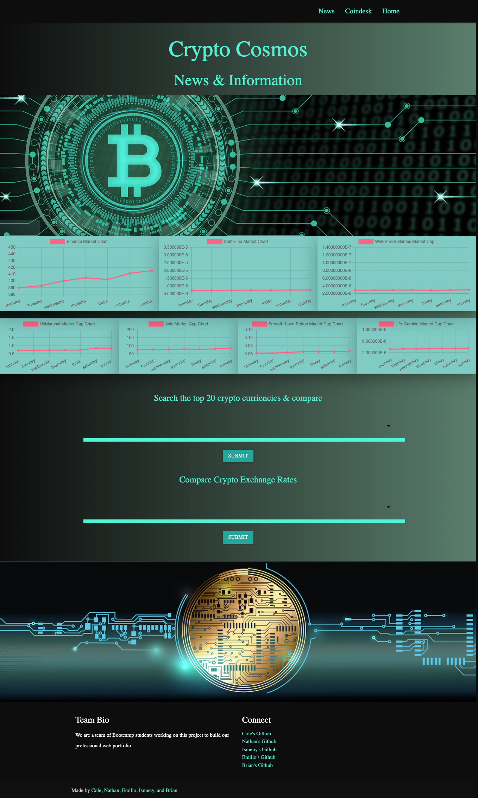
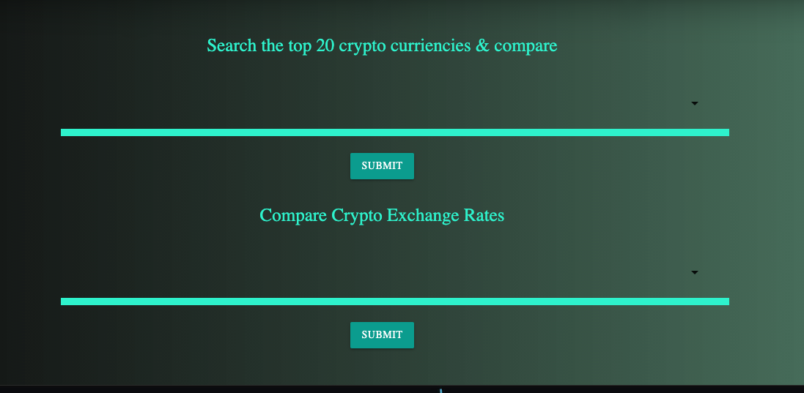
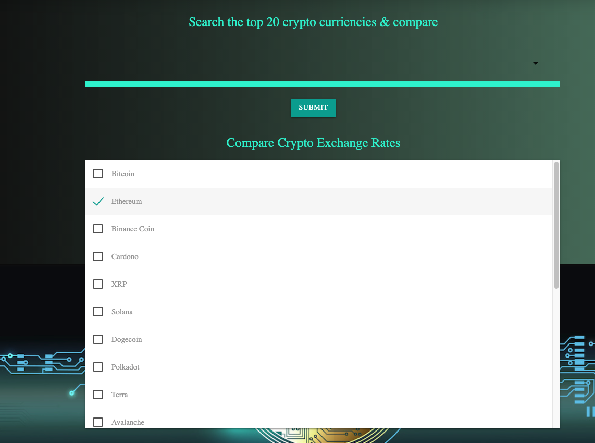
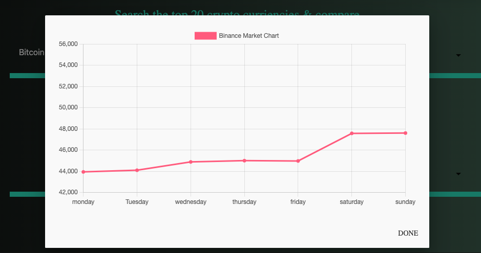
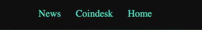

# Crypto Cosmos 

## Description
 A dashboard to monitor cryptocurrency and their shifting values so that you can manage your crypto assets. Our project includes graphs designed to display the top 7 markets total value of cryptocurrency. We also provide a search feature that allows you to choose from the top 20 crypto currencies and compare them. Our site also provides real time news on crypto currency and related stock market information. 

## Table of Contents 
* Installation
* Usage
* Credits
* License
* Contributions
* Test

## Installation
Go to URL : ***https://cole-cochran.github.io/Crypto-Cosmos/***

## Usage
* Go to URL and start exploring!  

* Here you can select from the top 20 crypto currencies you would like to view and compare   

* After clicking submit you will be presented with the information requested  

* Our navigation bar will allow you to move back and forth between the home page and news page. The Coindesk option will open a new page to their website.   

* Here you can view real time news on crypto currency and related stock market information 

## Credits
This website was built using:  
Materialize  1.0.0

## License
MIT

## Contributors
Ismeny Saguilan: https://github.com/Ismeny  
Nathan Delman: https://github.com/Delmanat3  
Cole Cochran: https://github.com/cole-cochran  
Brian Albright: https://github.com/bmalbright  
Emilio Estevez: https://github.com/Emilio512  

## Test
n/a

## Questions
Have any questions or ideas on how to improve our site? Please email us:  
Ismeny Saguilan: menysag2@gmail.com  
Nathan Delman: delman.nathan832@gmail.com   
Cole Cochran: colecochran405@gmail.com  
Brian Albright: brianalbright@utexas.edu  
Emilio Estevez: Edwardestevez95@gmail.com  

